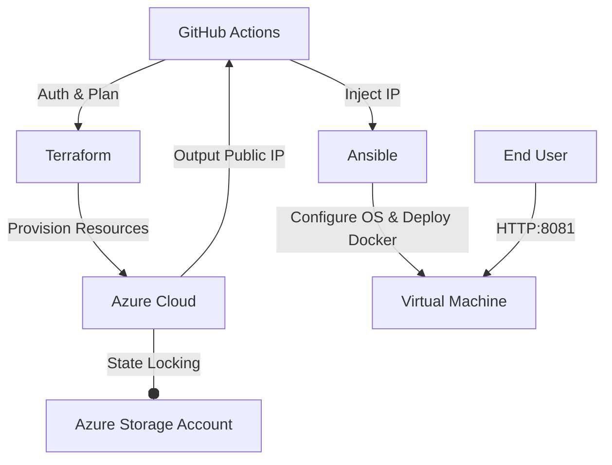

# Azure Infrastructure Automation & Configuration Management

A production-grade **Infrastructure as Code (IaC)** pipeline that orchestrates the provisioning of Azure resources and application configuration without manual intervention.

## 🚀 Engineering Scope

This project implements a **Platform Engineering** workflow integrating **Terraform** (Infrastructure) and **Ansible** (Configuration) via **GitHub Actions**.

* **Immutable Infrastructure:** Full lifecycle management of Networking (VNet, Subnet, NSG) and Compute (Linux VM) resources.
* **Dynamic Inventory Injection:** Automated bridging between Terraform outputs (Public IPs) and Ansible inventory at runtime.
* **Security by Design:** Implementation of `Standard` SKU IPs, strict NSG firewall rules, and secret injection via GitHub Secrets.
* **Remote State Management:** Terraform state stored securely in Azure Storage for consistency and team collaboration.

## 📐 Architecture

 ## 🛠 Tech Stack

| Component | Technology | Role |
| :--- | :--- | :--- |
| **Orchestration** | **GitHub Actions** | CI/CD Pipeline & Workflow automation. |
| **Provisioning** | **Terraform** | State-managed infrastructure creation. |
| **Config Mgmt** | **Ansible** | OS hardening, Docker installation, App deployment. |
| **Cloud** | **Microsoft Azure** | VNet, NSG, Public IP (Standard), Virtual Machine. |
| **Runtime** | **Docker** | Containerized Java API hosting. |

## ⚙️ Setup & Deployment

### Required Secrets
Configure the following in GitHub Repository Secrets:
* `AZURE_CREDENTIALS` (Service Principal JSON)
* `AZURE_SUBSCRIPTION_ID`, `AZURE_CLIENT_ID`, `AZURE_TENANT_ID`
* `VM_PASSWORD` (Admin access)

### Execution
The pipeline is triggered manually via **GitHub Actions** (`workflow_dispatch`) to allow controlled Apply or Destroy operations.

1. Select **"Deploy Infra & App"** workflow.
2. Input: `apply` (Provision) or `destroy` (Teardown).
3. **Endpoint:** `http://<VM_PUBLIC_IP>:8081/swagger-ui.html`

---
*DevOps Engineering Portfolio Project*